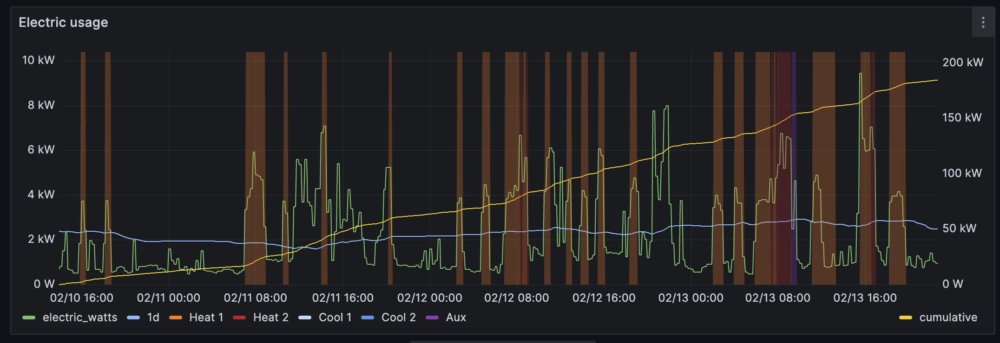

# electric-usage-downloader

This project reverse engineers the api at the electric co-op Novec, https://novec.smarthub.coop/ to allow
downloading 15-minute resolution electic usage and cost data for your personal account if you have a smart meter.

Data is imported into InfluxDB or VictoriaMetrics.

## Config

Download [config.example.yaml](config.example.yaml) and fill in your own values.

- `extract_days` is how many days to look back from the current day. Max is 45.
  if specific `--start` and `--end` flags are not specified.
- `account` is your account number, available on your bill and on the 
  Novec smart hub website.
- `service_location` is an internal Novec number. and must be retrieved from your browser:
  - Open the Developer tools to the Network tab
  - Navigate to [Usage Explorer](https://novec.smarthub.coop/ui/#/usageExplorer)
  - Find a call to `https://novec.smarthub.coop/services/secured/utility-usage/poll` in the Network tab
  - Open the call, and copy the `serviceLocationNumber` field from the Payload tab.
- `influxdb.insecure` allows connecting to a server with certificate issues.
- The other fields should be fairly self-explanatory.

## Running

- To download and insert the last `extract_days`, run like this arguments: `electric-usage-downloader --config config.yaml`
- To download and insert a specific date range, run with arguments: 
  `electric-usage-downloader --config config.yaml --start 2024-01-16 --end 2024-01-17`

## Details

The Novec api currently supports 15-minute resolution of data. This could change in the future; it used to be available
as downloaded CSV files as well, but now only hourly information is available that way.

Measurement: **electric**

Fields:
- **cost** (in US cents)
- **usage** (in watts)

## Dashboard

I have included my [Grafana dashboard panel definition](dashboard/panel.json) in the repo.

Features:
- Electric usage graphed in watts
- Trailing 1d and 7d averages
- Cumulative usage (right x axis)
- Integrated with data from my Ecobee thermostat, showing when my heat pump or aux oil heat is running.
  - See https://github.com/tedpearson/ecobeemetrics for how I get this data

Here's a screenshot of the dashboard panel in action:
